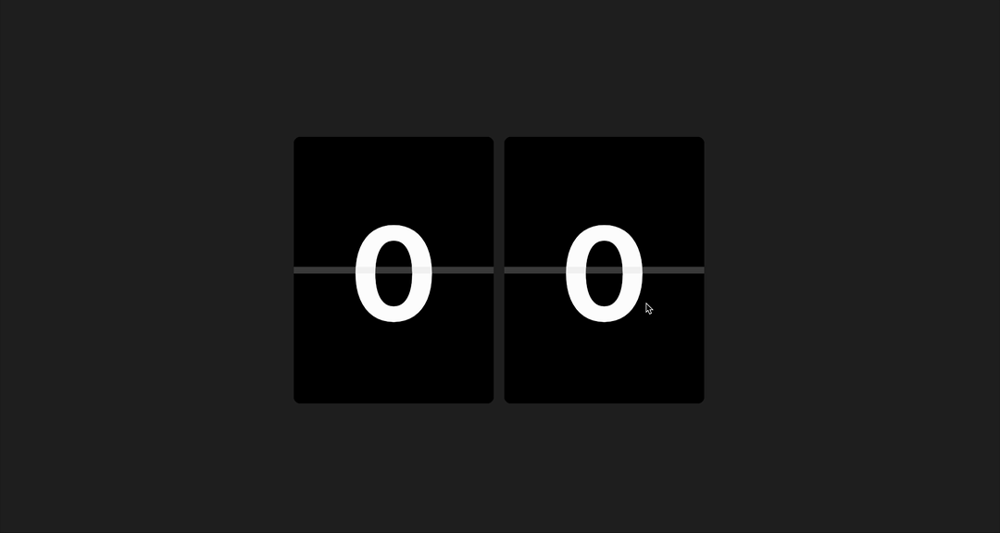

# Flipify



Flipify는 선언적인 Flip 애니메이션을 위한 타입스크립트 라이브러리입니다.

## Features

- 선언적인 Trigger 기반 애니메이션

  Flipify는 Flip 애니메이션을 선언적으로 처리해 간결하고 명확합니다. 사용자는 Trigger 함수 하나로, 애니메이션을 구현할 수 있습니다.

- TypeScript 기반의 강력한 타입 안정성

  Flipify는 상세하고 직관적인 타입 정의를 제공하여 안정적이고 예측 가능합니다.

- 유연한 스타일 커스터마이징

  Flipify는 다양한 요구사항에 맞춰 세부적인 스타일 속성을 제어할 수 있습니다. 물론, 기본값을 활용해 간편하게 사용할 수도 있습니다.

- 반응형 디자인 지원

  Flipify는 다양한 화면 크기에서 자연스럽게 적용됩니다.

## Installation

```bash
npm install @flipify/core
```

```bash
pnpm add @flipify/core
```

```bash
yarn add @flipify/core
```

## Usages

### JavaScript

```html
<div id="flip-container"></div>
```

```javascript
import { initialize } from '@flipify/core';

document.addEventListener('DOMContentLoaded', () => {
  const container = document.querySelector('div.flip-container');

  console.log(container);

  container.style.width = '100vw';
  container.style.height = '100vh';

  let currentNumber = 97;
  const { trigger } = initialize(container, currentNumber, { useDigit: true });

  const interval = setInterval(() => {
    currentNumber += 1;

    if (trigger) {
      trigger(currentNumber);
    }
  }, 1000);

  window.addEventListener('unload', () => {
    clearInterval(interval);
  });
});
```

### React

```typescript
import { initialize } from '@flipify/core';
import React, { useEffect, useRef, useState } from 'react';

export const Flip: React.FC = () => {
  const containerRef = useRef<HTMLDivElement>(null);
  const triggerRef = useRef<((value: number) => void) | null>(null);
  const [currentNumber, setCurrentNumber] = useState(0);

  useEffect(() => {
    const container = containerRef.current;

    if (!container) return;

    const { trigger } = initialize(container, currentNumber, { useDigit: true });

    triggerRef.current = trigger;
  }, []);

  useEffect(() => {
    const interval = setInterval(() => {
      setCurrentNumber((prev) => prev + 1);

      if (triggerRef.current) {
        triggerRef.current(currentNumber);
      }
    }, 1000);

    return () => clearInterval(interval);
  }, [currentNumber]);

  return <div ref={containerRef} style={{ height: '50vh' }} />;
};
```

## Options

| **옵션**                           | **타입**     | **설명**               | **기본값**  | **비고**                                                   |
| ---------------------------------- | ------------ | ---------------------- | ----------- | ---------------------------------------------------------- |
| `useDigit`                         | `boolean`    | 자릿수 변경 여부       | `false`     | `true`, `false`                                            |
| `animation.duration`               | `TDuration`  | 애니메이션의 지속 시간 | `500`       | `ms` 단위, 예: `1000`, `500`                               |
| `style.card.width`                 | `TDimension` | 카드의 너비            | `300px`     | `number`로도 사용 가능, 예: `100px`, `20%`, `10rem`, `100` |
| `style.card.height`                | `TDimension` | 카드의 높이            | `400px`     | `number`로도 사용 가능, 예: `200px`, `20%`, `10rem`, `200` |
| `style.card.fontSize`              | `TDimension` | 카드의 폰트 크기       | `200px`     | `number`로도 사용 가능 , 예: `20px`, `3rem`, `18`          |
| `style.card.borderRadius`          | `TDimension` | 카드의 테두리 반경     | `10px`      | `number`로도 사용 가능 , 예: `10px`, `50%`, `5`            |
| `style.centerLine.height`          | `TDimension` | 중앙선의 높이          | `10px`      | `number`로도 사용 가능 , 예: `2px`, `1rem`, `5`            |
| `style.centerLine.backgroundColor` | `TColor`     | 중앙선의 배경색        | `#DDDDDD50` | 예: `#000000`, `rgba(0, 0, 0, 0.2)`                        |
| `style.number.color`               | `TColor`     | 숫자의 색상            | `#FFFFFF`   | 예: `white`, `#ff5722`, `rgb(0, 0, 0)`                     |
| `style.number.backgroundColor`     | `TColor`     | 숫자의 배경색          | `#000000`   | 예: `black`, `#eeeeee`, `rgb(255, 255, 255)`               |

## Licenses

[MIT License](./LICENSE)

Copyright (c) 2024 HyoungMin
